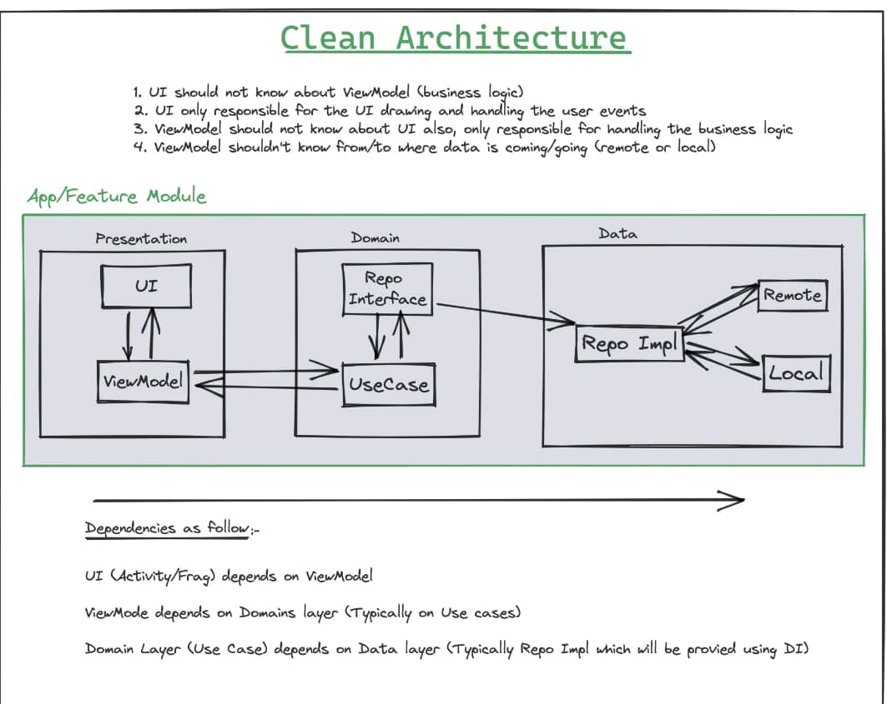

## HazardHunter

Hazard Hunter is an Android application designed to bolster safety measures in workplace environments, utilising key Android architecture components like activities, services, and broadcast receivers. The user interface is crafted with JetPack Compose, ensuring an intuitive design, while data persistence is effectively handled through the Android Room library and shared preferences. To enhance code quality, the app undergoes static analysis using Detekt and Kotlin Lint. Following a structured MVVM architecture, Hazard Hunter incorporates Lottie for engaging animations, integrates the Retrofit Library for efficient network calls, and employs the Dagger-Hilt Library for seamless automated dependency injection. 
  

## ✨ Features
 - [ ] Emergency SOS Button:
   The aap has a prominently placed SOS button on the main screen, easily accessible in case of emergencies. When pressed, this button triggers a series of actions 
   to alert predefined contacts or emergency services.
  
- [ ] Location Tracking:
Real-time GPS tracking to share the user's location with trusted contacts during an emergency. This feature helps responders locate the user quickly.
Personal Guardian Services:

- [ ] A virtual guardian system that allows users to set a timer for a specific activity. If the user doesn't confirm their safety within a specified timeframe, the app sends an alert to designated contacts.
Check-In Feature:

- [ ] Report Incidents
   If they fail to check in, the application can send notifications to selected contacts or trigger an emergency response. Audio and Video Recording:

- [ ] Emergency Locator
An audible alarm or flashing light that can be activated to attract attention in crowded or isolated areas.
Safety Tips and Information:

- [ ] contnous learning
Educational content on personal safety, emergency preparedness, and self-defense techniques.
Community Watch:

- [ ] continous updates
Continuous updates to enhance the app's features, security, and usability based on user feedback and emerging safety pratices.

 |  |

# Application Architecture:

## Architecture diagram

# View:

The View class is the base class or we can say that it is the superclass for all the GUI components in android. For example, the EditText class is used to accept the input from users in android apps, which is a subclass of View, and another example of the TextView class which is used to display text labels in Android apps is also a subclass of View. 

# ViewModel:

A view model is responsible only for taking the result of an action and mapping it into a ViewState. It connects the view with any use case. It consumes ui events, triggers use cases and processes a use case response into a ViewState that is exposed For the screen to render.

# UseCase

A use case is responsible for whatever happens between a view model and repository i.e. consuming responses from data requests and mapping that into a relevant result for the ViewModel to handle.

# Repository:

A repository is any component that is responsible for making data requests. This could be a remote server, local preference, database, etc. The repository should not have side effects such as calling a different repository. The response should map information from Dto(data transfer objects) to domain-specific data classes.
 Repositories should not be responsible for data manipulation of response. For example, suppose a repository is requesting a list of users, but the screen only cares about users with a certain property. In that case, the use case should be responsible for filtering the list accordingly. By removing logic from your view model, we make the view model slim and separate business logic from our repository(which should only fetch data.

## 🔌 Plugins

| Name                                                    | Usage                                               |
| ------------------------------------------------------- | --------------------------------------------------- |
| [**Retrofit**](https://square.github.io/retrofit/)      | HTTP Requests                                       |
| [**Material3**](https://bumptech.github.io/glide/)          | for consistent ui design                                |
| [**Dagger Hilt**](https://developer.android.com/training/dependency-injection/hilt-android/)| Automated Dependency Injection                |
| [**Room Library**](https://developer.android.com/jetpack/androidx/releases/room)| Data Storage and persistence|
| [**Turbine**](https://github.com/cashapp/turbine)| Testing Flow|
| [**LoitteAnimation**](https://airbnb.io/projects/lottie-android/)|Animation library|
| [**Truth Library**](https://truth.dev/)|Assertion Test|
| [**Mockk**](https://mockk.io/)|Creating Fake Entities for TestTest|

