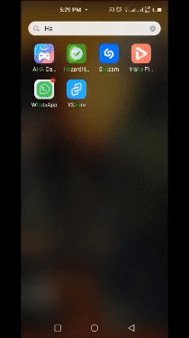
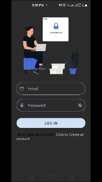

# HazardHunter

equalizer 3

A well-designed Android safety application combines the various Android Core Components  to provide a comprehensive solution for personal safety and emergency response.

This Android safety application is designed to enhance the safety and well-being of users by providing various features and functionalities that can be utilized in emergency situations or for general personal safety. Here's a description of key features that a comprehensive Android safety application might include:

Emergency SOS Button:

The app should have a prominently placed SOS button on the main screen, easily accessible in case of emergencies. When pressed, this button triggers a series of actions to alert predefined contacts or emergency services.
Location Tracking:

Real-time GPS tracking to share the user's location with trusted contacts during an emergency. This feature helps responders locate the user quickly.
Personal Guardian Services:

A virtual guardian system that allows users to set a timer for a specific activity. If the user doesn't confirm their safety within a specified timeframe, the app sends an alert to designated contacts.
Check-In Feature:

Users can set regular check-in intervals with the app. If they fail to check in, the application can send notifications to selected contacts or trigger an emergency response.
Audio and Video Recording:

The ability to record audio or video during an emergency, providing valuable evidence or context for the situation. These recordings can be automatically sent to pre-defined contacts or stored securely in the cloud.
Emergency Services Directory:

Integration with local emergency service directories, providing quick access to contact numbers for police, fire, medical assistance, etc.
In-App Chat or Call:

A secure and private communication channel within the app for users to chat or make calls to their emergency contacts directly.
Panic Alarm:

An audible alarm or flashing light that can be activated to attract attention in crowded or isolated areas.
Safety Tips and Information:

Educational content on personal safety, emergency preparedness, and self-defense techniques.
Community Watch:

Integration with a community-based safety network where users can report incidents, share safety tips, and support each other.
Offline Mode:

Basic functionality should be available even without an internet connection to ensure usability in areas with poor connectivity.
Privacy Controls:

Robust privacy settings to allow users to control who has access to their information and when.
Biometric Authentication:

An additional layer of security through fingerprint or facial recognition to prevent unauthorized access to the app.
Wearable Device Integration:

Compatibility with smartwatches or other wearable devices for quick access to safety features.
Regular Updates and Improvements:

Continuous updates to enhance the app's features, security, and usability based on user feedback and emerging safety trends.

 |  |

Application Architecture:

Architecture diagram

- [x] View:
The View class is the base class or we can say that it is the superclass for all the GUI components in android. For example, the EditText class is used to accept the input from users in android apps, which is a subclass of View, and another example of the TextView class which is used to display text labels in Android apps is also a subclass of View. 

- [x] ViewModel:
A view model is responsible only for taking the result of an action and mapping it into a ViewState. It connects the view with any use case. It consumes ui events, triggers use cases and processes a use case response into a ViewState that is exposed For the screen to render.

- [x] UseCase
 A use case is responsible for whatever happens between a view model and repository i.e. consuming responses from data requests and mapping that into a relevant result for the ViewModel to handle.

- [x] Repository:
A repository is any component that is responsible for making data requests. This could be a remote server, local preference, database, etc. The repository should not have side effects such as calling a different repository. The response should map information from Dto(data transfer objects) to domain-specific data classes.
 Repositories should not be responsible for data manipulation of response. For example, suppose a repository is requesting a list of users, but the screen only cares about users with a certain property. In that case, the use case should be responsible for filtering the list accordingly. By removing logic from your view model, we make the view model slim and separate business logic from our repository(which should only fetch data.

## ✨ Features
- [x] Search for Task by keyword.
- [x] measure safety data using android sensor
- [x] Create a user account with email and password
- [x] Reset Password 
- [x] Search Tasks by category.

## 🔌 Plugins

| Name                                                    | Usage                                               |
| ------------------------------------------------------- | --------------------------------------------------- |
| [**Retrofit**](https://square.github.io/retrofit/)      | HTTP Requests                                       |
| [**Material3**](https://bumptech.github.io/glide/)          | for consistent ui design                                |
| [**Dagger Hilt**](https://developer.android.com/training/dependency-injection/hilt-android/)| Automated Dependency Injection                |
| [**Room Library**](https://developer.android.com/jetpack/androidx/releases/room)| Data Storage and persistence|
| [**Turbine**](https://github.com/cashapp/turbine)| Testing Flow|
| [**LoitteAnimation**](https://airbnb.io/projects/lottie-android/)|Animation library|
| [**Truth Library**](https://truth.dev/)|Assertion Test|
| [**Mockk**](https://mockk.io/)|Creating Fake Entities for TestTest|

