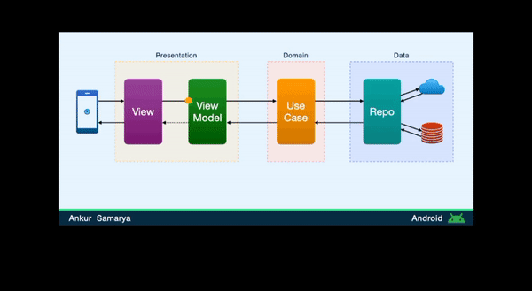

# HazardHunter

Application Architecture:

Architecture diagram

- [x] ViewModel:
A view model is responsible only for taking the result of an action and mapping it into a ViewState. It connects the view with any use case. It consumes ui events, triggers use cases and processes a use case response into a ViewState that is exposed For the screen to render.

- [x] UseCase
 A use case is responsible for whatever happens between a view model and repository i.e. consuming responses from data requests and mapping that into a relevant result for the ViewModel to handle.

- [x] Repository:
A repository is any component that is responsible for making data requests. This could be a remote server, local preference, database, etc. The repository should not have side effects such as calling a different repository. The response should map information from Dto(data transfer objects) to domain-specific data classes.
 Repositories should not be responsible for data manipulation of response. For example, suppose a repository is requesting a list of users, but the screen only cares about users with a certain property. In that case, the use case should be responsible for filtering the list accordingly. By removing logic from your view model, we make the view model slim and separate business logic from our repository(which should only fetch data.

## ✨ Features
- [x] Search for Task by keyword.
- [x] measure safety data using android sensor
- [x] Create a user account with email and password
- [x] Reset Password 
- [x] Search Tasks by category.

## 🔌 Plugins

| Name                                                    | Usage                                               |
| ------------------------------------------------------- | --------------------------------------------------- |
| [**Retrofit**](https://square.github.io/retrofit/)      | HTTP Requests                                       |
| [**Glide**](https://bumptech.github.io/glide/)          | Loading Images                                     |
| [**Dagger Hilt**](https://developer.android.com/training/dependency-injection/hilt-android/)| Automated Dependency Injection                |
| [**Room Library**](https://developer.android.com/jetpack/androidx/releases/room)| Data Storage and persistence|
| [**Turbine**](https://github.com/cashapp/turbine)| Testing Flow|
| [**LoitteAnimation**](https://airbnb.io/projects/lottie-android/)|Animation library|
| [**Truth Library**](https://truth.dev/)|Assertion Test|
| [**Mockk**](https://mockk.io/)|Creating Fake Entities for TestTest|

